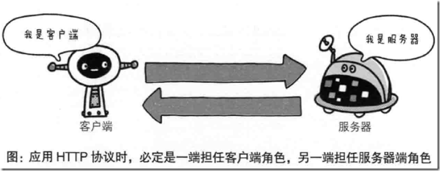   
报文格式  
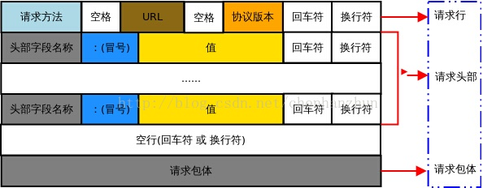  

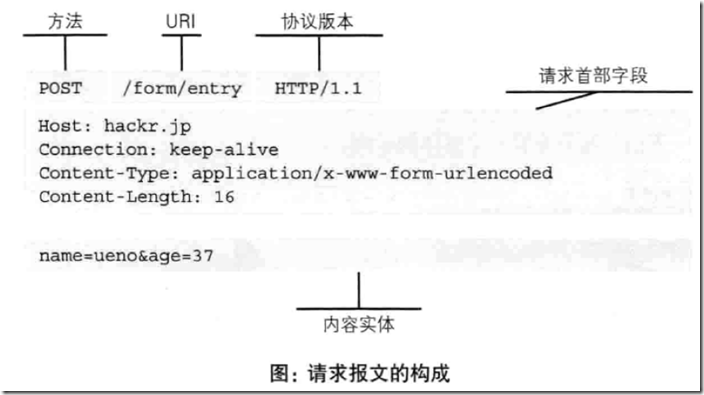  

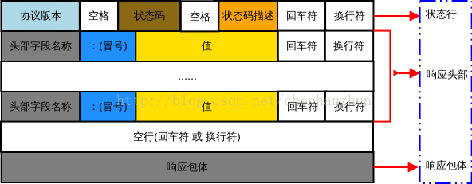   

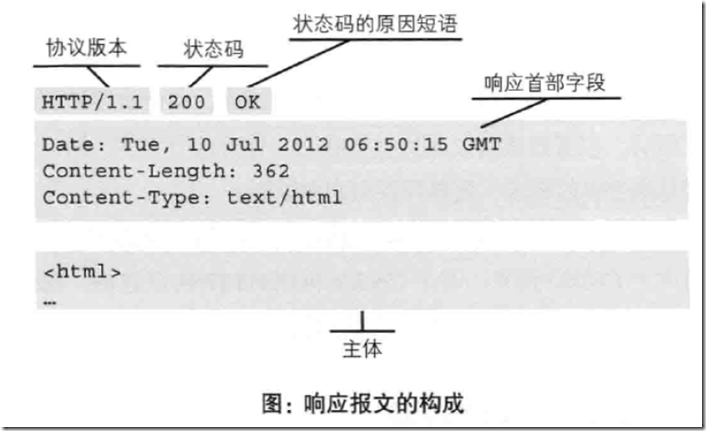   

> 可以使用telnet模拟http协议，telnet <主机名> <端口号>，回车之后按照http报文格式输入内容，即可发送http请求到服务器，稍后telnet会将服务器响应结果展示在控制台中

### 常见HTTP状态码
- 100   服务器正确处理了客户端响应，客户端可以继续发生数据，一般出现在文件上传的过程  
- 101   服务器理解客户端的协议升级请求，一般出现在websocket通讯中  
- 200   请求正常响应  
- 301   资源地址已更新，需要客户端重定向到新地址，永久重定向  
- 302   和301类似，只不过资源的地址还可能再次变化  
- 304   资源内容未变动，客户端可以继续使用缓存的内容，服务器不会传输资源内容
- 400   客户端提交的请求参数有误
- 401   客户端未得到服务器的认证，需要客户端重新提供正确的认证信息
- 403   不允许客户端访问该资源，该资源为受限资源
- 405   客户端的请求方法有误
- 500   服务器内部发生异常
- 502   作为网关或者代理工作的服务器尝试执行请求时，从上游服务器接收到无效的响应
- 503   由于临时的服务器维护或者过载，服务器当前无法处理请求。这个状况是临时的，并且将在一段时间以后恢复

### HTTPS
https要解决的问题： 数据传输过程中，数据被窃听风险，数据被篡改风险，数据被劫持风险   
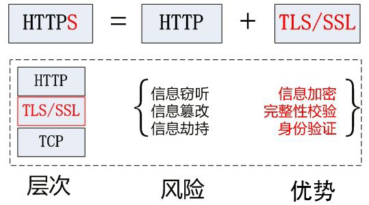   

https在解决安全风险过程中主要用到三种算法：  
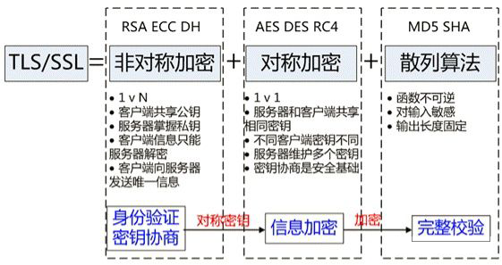   

### HTTPS协议握手过程
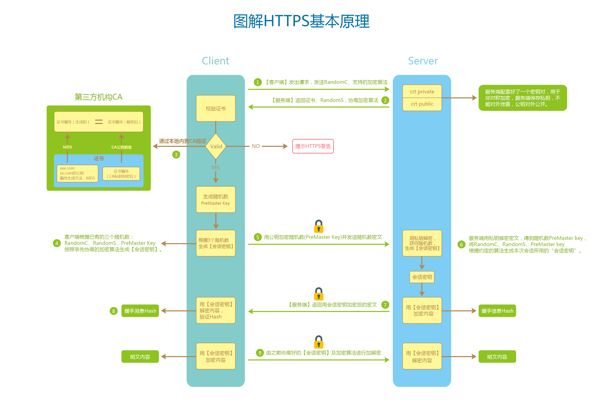    

要点：   

- 服务器和客户端在真正传输数据时，使用的是对称加密算法   
- 对称加密的算法和密钥是会话开始前（握手阶段），由服务器和和客户端协商确定的，也就是会话开始前加密算法和密钥是不确定的   
- 对称加密的密钥是依据RandomC（第一次客户端请求），RandomS（第一次服务端响应），PreMasterKey（第二次客户端请求），和实现协商约定的算法计算得到，也就是由客户端和服务器各自在本地计算得到   
- 客户端使用的非对称加密的公钥由服务器以证书的形式发送给客户端   
- 服务器证书包含，版本，序列号，颁发者（以及证书链），使用者（服务器域名），服务器公钥，有效期，签名算法，签名哈希算法，证书签名等   
- 客户端在拿到证书后，会检查证书中的域名是否是当前要访问的域名，证书是否过期，证书的颁发者是否是客户端认可的机构   
- 客户端不仅会对证书中描述的信息进行检查，还会依据证书提供的校验机制对证书本身进行校验   
- 客户端把证书中的信息进行哈希计算，得到唯一哈希值，然后拿证书颁发者的公钥对证书签名进行解密，比对这两个值是否一致   
- 最终服务器响应的内容是之前握手阶段所有信息的hash经对称加密密钥加密的结果，交由客户端最总解密并校验通过整个握手阶段就算完成   

> 数字证书其实就是服务器的网络“身份证”，携带服务器信息并且可以证明服务器的真实身份，这个证书的制作过程不是由一个机构统一发放，而是层层颁发，比如 A 持有了可信证书，那么它颁发给的 B 的证书也是可信的， B 再颁发给 C 的证书也是可信的。其中 A 的证书为“根证书”，B 的为“中介证书”，C 的为“终端证书”。 而 A、B 都被称作认证机构，简称 CA（Certificate authority）。根证书通常预先安装在操作系统和浏览器中，是由大公司和政府联合制作的，作为证书链的起点。  
> 
> 信息加密的需求其实一直都存在，从古代开始就使用各种技术来加密重要的信息，但是古代的加密安全程度都是基于加密方式的。也就是说，别人如果知道了加密方式，那么就可以解密密文信息。  
> 
> 而现代的加密技术安全性在于密钥的安全，也就是说加密方式（算法）是公开的，只要密钥不被窃取或泄露，信息就是安全的。虽然加密算法有很多种，但是大致上可以分为两类：对称加密和非对称加密。对称加密的通信双方都是用同一个密钥进行加解密，而非对称加密则要求使用不同的密钥进行加密和解密。

### 证书签名的校验过程
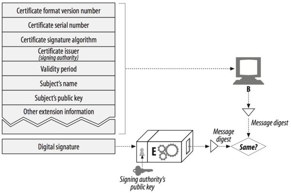   

### 如何通过证书链拿到证书的上级签发机构的公钥
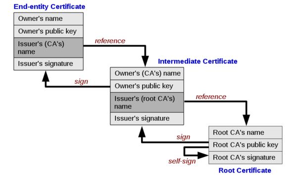  

### 生成自签名证书
生成密钥：`openssl genrsa -out server.key 4096`  
生成签名请求证书（提交给CA机构的待签名证书）：`openssl req -new -key server.key -out server.csr`  
证书自签名：`openssl x509 -req -in server.csr -signkey server.key -out server.crt`
> 免费证书申请渠道: [letsencrypt](http://wiki.baozun.com/pages/createpage.action?spaceKey=ECS&title=letsencrypt&linkCreation=true&fromPageId=28353258)

### nginx启用https功能
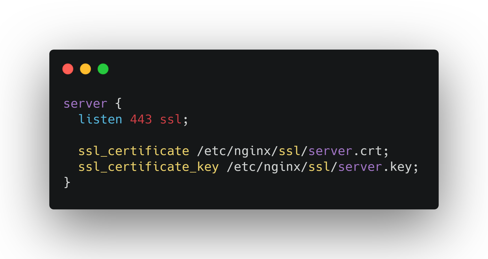  
> 详细配置见 https://nginxconfig.io