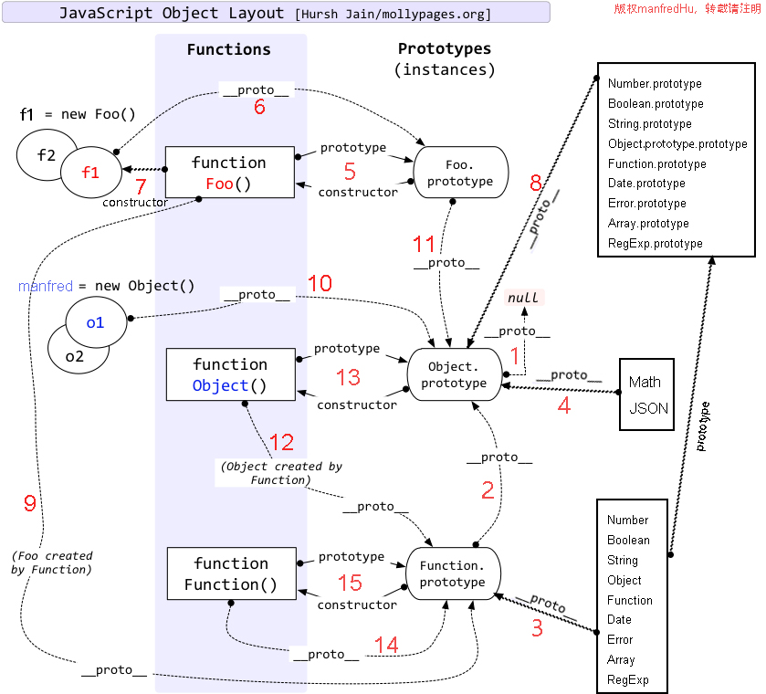

### 对象简写形式
```
const name = 'Zhang';
const key = 'motto';
const fn = 'speak';

const human = {
  name,
  get country(){
    return 'China';
  },
  [key]: 'Never say die',
  introduce (){
    return `My name is ${this.name} , i am from ${this.country}.`;
  },
  [fn](){
    return `My motto is ${this.motto}`;
  }
}

// 简写的对象方法不能用作构造函数
new human.introduce();
new human.speak();
```
> **super** 只能出现在Class方法和对象简写方法中


### 对象扩展运算符
- 用于合并两个对象  
```
let ab = { ...a, ...b };

// 等同于
let ab = Object.assign({}, a, b);
```
- 修改现有对象属性  
```
let newObj = {
  ...oldObj,
  name: 'New Name' 
};

// 等同于
let newObj = Object.assign(oldObj, {name: 'New Name});
```
- 可以跟表达式
```
const obj = {
  ...(x > 1 ? {a: 1} : {}),
  b: 2,
};
```
- 不能复制继承自原型对象的属性
```
const o = Object.create({ x: 1, y: 2 });
o.z = 3;

let { x, ...newObj } = o;
let { y, z } = newObj;
x // 1
y // undefined
z // 3
```


### 链判断运算符
判断左侧的对象是否为 `null` 或 `undefined` 如果是的，不再往下运算，直接返回 `undefined`  
```
const firstName = message?.body?.user?.firstName || 'default';
const passwordValue = loginForm.querySelector('input[name=password]')?.value;
person.sayHello?.();
```
> 链运算符禁止用于赋值运算符左侧 `a?.b = c`  
**短路机制**  
```
a?.[++x]
// 等同于
a == null ? undefined : a[++x]
```
如果 `a` 是 `undefined` 或 `null`，那么 `x` 不会进行递增运算


### Null 判断运算符
它的行为类似 `||`，但是只有运算符左侧的值为 `null` 或 `undefined` 时，才会返回右侧的值
```
// 之前的做法
let result = response.result || 'default'; // 当 response.result 为 0 '' false 时 result 被错误的赋值为 'default'

// 改进的做饭
let result = response.result ?? 'default'; // 仅当 response.result 为 null 或者 undefined 时 result 才会赋值为 'default'
```


### 对象属性枚举与遍历
以下四个操作会忽略描述符 `enumerable` 为 `false` 的属性
- `for...in` 遍历对象自身和继承的可枚举的属性（包括方法）
- `Object.keys` 返回对象自身可枚举属性名称的数组（包括方法）
- `JSON.stringify` 只串行化对象自身可枚举的属性和 `Object.keys` 类似但是不包括方法
- `Object.assign` 只拷贝对象自身可枚举的属性和 `Object.keys` 一致
> 类中定义的方法都是不可枚举的，尽量 `Object.keys` 替代 `for...in`


### API备忘录
- **`Object.assign`** 复制一个或多个对象来创建一个新的对象，源对象和目标对象可以是数组
- **`Object.keys`** 返回对象自身可枚举属性名称的数组
- **`key in object`** 可以访问到对象任何属性
- `Object.prototype.toString` 返回对象的字符串表示，重写该方法可以实现特殊效果
- `Object.prototype.valueOf` 返回对象的原始值，如果对象没有原始值，则valueOf将返回对象本身，重写该方法可以实现特殊效果
- `Object.prototype.hasOwnProperty` 判断某个属性是否属于对象自身，而非来自原型链
- `Object.prototype.isPrototypeOf` 判断指定的对象是否存在于本对象的原型链
- `Object.prototype.propertyIsEnumerable` 判断当前对象的属性是否是可枚举的
- `Object.getOwnPropertyNames` 除了包含 `Object.keys` 结果外还会包含对象自身不可枚举的属性
- `Object.create` 使用指定对象作为新创建对象的原型，第二个可选参数为属性描述符
- `Object.is` 绝对比较两个值是否相等，比 `===` 更严格，+0 和 -0 不相等，NaN 互不相等
- `Object.defineProperty` 给对象添加指定属性并指定属性的配置
- `Object.getPrototypeOf` 返回指定对象的原型 `Object.getPrototypeOf(Child) === Parent`
- `Object.setPrototypeOf` 设置指定对象的原型
- `Reflect.ownKeys` 除了包含 `Object.getOwnPropertyNames` 结果外还会包含对象自身 `Symbol` 属性


### 类定义
```
let ability = 'eat';

class Human {
  name = 'Zhang'; // 可以定义实例属性
  [ability](){ } // 动态属性名

  // 私有属性和方法使用 # 为前缀，避免和其他变量混淆，而且私有属性和私有方法可以和正常的属性和方法重名
  // 之所以要引入一个新的前缀#表示私有属性，而没有采用private关键字，是因为 JavaScript 是一门动态语言，没有类型声明，
  // 使用独立的符号似乎是唯一的比较方便可靠的方法，能够准确地区分一种属性是否为私有属性
  #nickname = 'z'; 
  #introduce(){ 
    return `My nickname is ${this.#nickname} , my motto is ${this.#introduce()}`;
  } 
  introduce(){ // 私有和公开方法名可以重名
    return this.#introduce();
  }

  constructor(){
    // 如果当前函数通过 new 关键字执行，new.target 返回执行 new 时的函数
    // 利用这个特点，可以写出不能独立使用、必须继承后才能使用的类
    if (new.target === Human) {
      throw new Error('本类不能实例化');
    }
  }

  // 静态属性仍处于提案阶段
  static age = 11; 

  // 如果静态方法包含this关键字，这个this指的是类，而不是实例
  static speak() { 
    this.hello();
  }
  static hello() { } 
}

// 也可以通过表达式定义类，即匿名类
const h = class Human { }
// 省略类名
const h = class { }
// 立即执行的Class 
const h = new class { }()


// 子类继承父类
class Student extends Human {
  // 子类继承父类时，子类要么不写构造函数如果写构造函数就必须在构造函数中调用super()，而且必须在使用this之前调用，否则在创建类实例时会报错
  constructor() {
    console.log('student init ...');
    super();
    this.score = 100;
  }
} 
```
- 类中定义的方法都是不可枚举的
- 类内部默认启用严格模式
- 类不存在变量提升，保证类的继承
- 类必须通过 `new` 关键字来调用，不能单独调用，否则报错
- `super()` 相当于 `Parent.prototype.constructor.call(this)` 而 `this` 指向 `Child` 的实例，也就是在`new Child()`时，当执行父类的构造函数时，`this` 指向子类对象，执行子类其他函数时如果函数里面又通过 `super.xxx()` 执行了父类方法，那么父类方法里面的 `this` 也是指向子类对象
- 如果在子类方法中访问 `super.xxx` 能够访问定义父类原型上的方法和属性，不能访问实例属性，也就是在子类中 `super.xxx()` 相当于 `Parent.prototype.xxx.call(this)`  `super.xxx` 相当于  `Parent.prototype.xxx`
- 如果通过 `super` 对某个属性赋值，这时 `super` 就是 `this`，赋值的属性会变成子类实例的属性
- 在子类的静态方法中通过 `super` 调用父类的方法时，方法内部的 `this` 指向当前的子类，而不是子类的实例
- 类可以继承原生类，从而可以根据原生类自定义自己的类，包括：`Number` `Boolean` `String` `Date` `Array` `RegExp` `Object` `Function` `Error`


### 子类 __proto__ 与 prototype
- 子类的 `__proto__` 属性，表示构造函数的继承，总是指向父类
- 子类 `prototype` 属性的 `__proto__` 属性，表示方法的继承，总是指向父类的prototype属性
```
class A {
}

class B extends A {
}

B.__proto__ === A // true
B.prototype.__proto__ === A.prototype // true
```
**继承的本质**  
```
class A {
}

class B {
}

// B 的实例继承 A 的实例
Object.setPrototypeOf(B.prototype, A.prototype);

// B 继承 A 的静态属性
Object.setPrototypeOf(B, A);

const b = new B();
```
**继承的特殊场景**  
```
// 子类继承Object类
class A extends Object {
}

A.__proto__ === Object // true
A.prototype.__proto__ === Object.prototype // true
// 这种情况下，A其实就是构造函数Object的复制，A的实例就是Object的实例


// 不存在任何继承
class A {
}

A.__proto__ === Function.prototype // true
A.prototype.__proto__ === Object.prototype // true
// 这种情况下，A作为一个基类（即不存在任何继承），就是一个普通函数，所以直接继承Function.prototype。但是，A调用后返回一个空对象（即Object实例），所以A.prototype.__proto__指向构造函数（Object）的prototype属性
```


### 原型链图解



