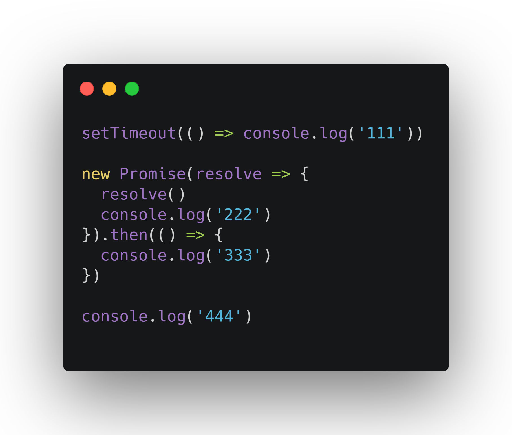
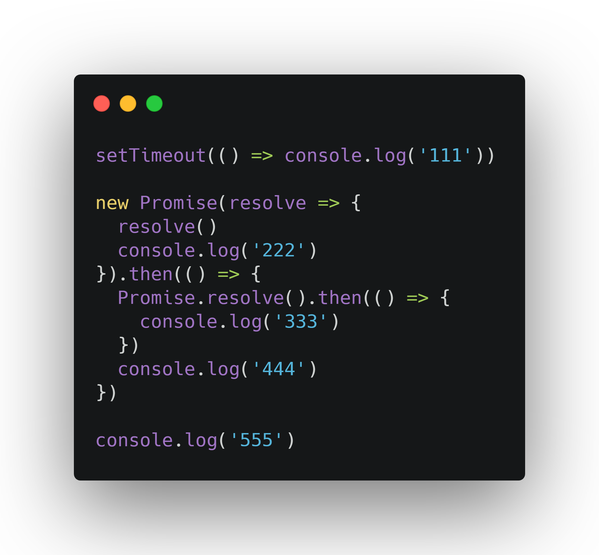
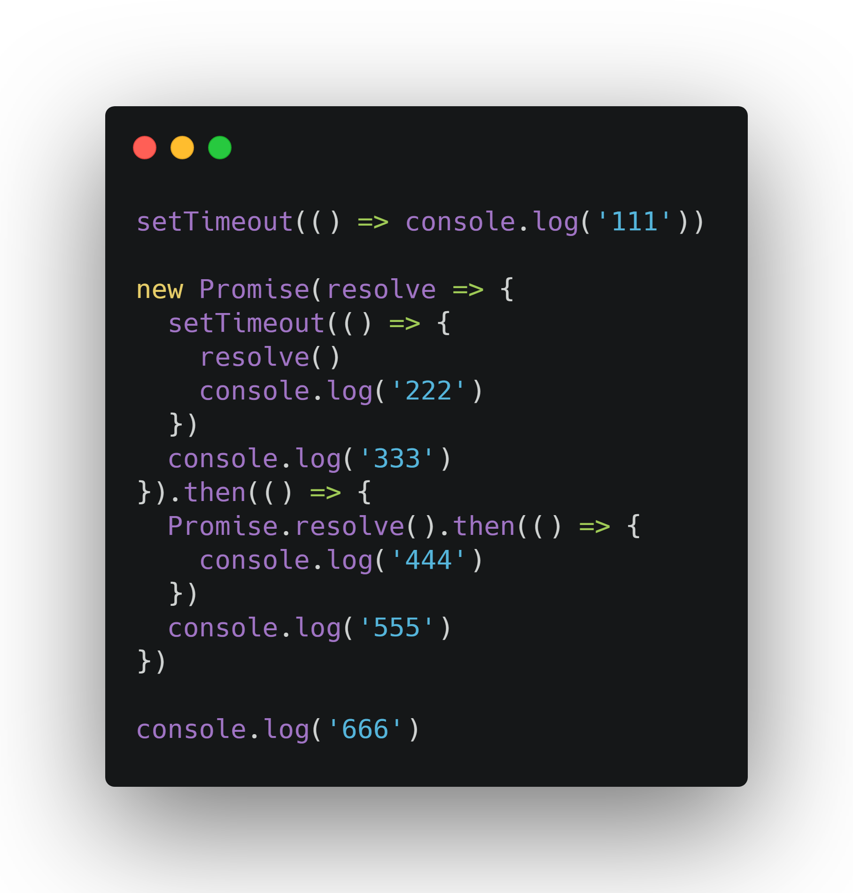
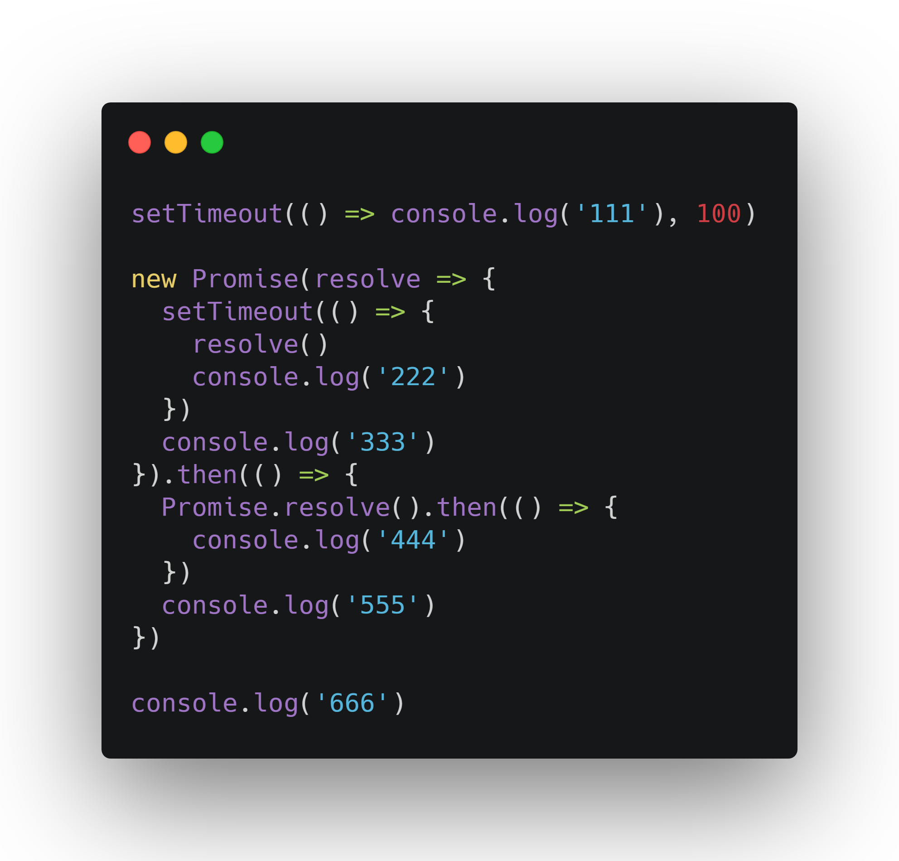
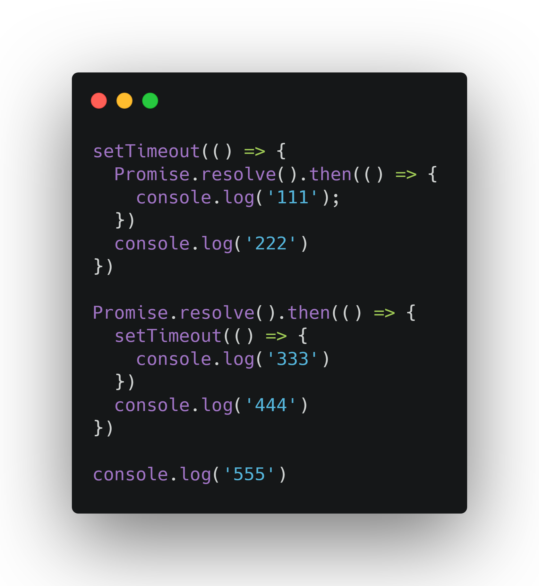

首先浏览器解析页面，遇到 `script` 标签时会将其中的js代码放入回调队列（1

事件轮询（Event Loop）会在执行堆栈（Call Stack）为空时，自动检测回调函数队列（Callback Queue），并按照先进先出的顺序，取出函数放入执行堆栈中执行（2

当函数在执行堆栈中执行时，如果遇到耗时或者异步（ajax，定时器，文件读写，ui事件监听）的操作，简称异步任务，js引擎会将任务交由Web APIs处理（3

这些异步任务在执行完成或者触发时，如果有回调函数，Web APIs会将这些回调函数放入回调队列（4

js引擎会继续执行（2步骤，循环往复

[在线演示](http://latentflip.com/loupe)

### 宏任务与宏任务
回调队列分为宏任务队列和微任务队列，每当事件轮询从宏任务队列取出一个宏任务放入执行堆栈，执行完毕之后再将微任务队列一个个取出执行，当微任务队列清空之后，渲染引擎开始绘制工作，之后再循环往复执行宏任务队列任务

- 宏任务：setTimeout  |  setInterval  |  requestAnimationFrame  |  载入script脚本  |  I/O（ajax，定时器，文件读写，ui事件监听）
- 微任务：promise.then  |  MutationObserver

### 微任务/宏任务执行顺序演练

