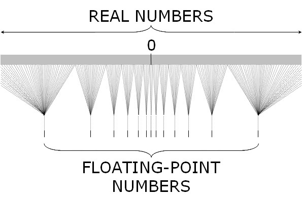

### 数字类型
JavaScript有两种数字类型：基本数字类型和大整数类型  
基本数字类型采用 **IEEE754** 规范中的64位浮点数保存数值，浮点数相较于 **定点数** ，可以表示 **极大值** 和 **极小值**，但是无法完全保证数字 **精度** 和 **范围**，不适合科学 金融等方面的精确计算，举例：  
```js
// 超过 53 个二进制位的数值，无法保证精度
Math.pow(2, 53) === Math.pow(2, 53) + 1 // true

// 超过 2 的 1024 次方的数值，无法表示
Math.pow(2, 1024) // Infinity

```
**ES2020** 引入了大整数类型 **BigInt** ，只能用来表示整数，没有位数限制，可以进行大数计算


### 64位浮点数
IEEE754规范使用类似 **科学记数法** 表示浮点数
  
**浮点数存储方式**  
  
**转换公式**    
  
- **sign** 符号位S，表示数字正负，1为负数，0为正数
- **exponent** 阶码E，保存指数信息，取值范围 0 ~ 2047，因为科学记数法中的指数可以是负数，所以约定减去一个偏移量1023，[0,1022]表示负指数，[1024,2047]表示正指数，**指数 = E - 1023**，阶码决定数值绝对值大小
- **mantissa** 尾数M，因为使用二进制科学记数法第一位总是1，所以存储时默认省略第一位1，即 **尾数 = M + 1** 


### 十进制转二进制
- 整数部分  

- 小数部分  


### 如何显示一个数的二进制形式
```
let num1 = 9;
let num2 = 0.1;
num1.toString(2); // 1001
num2.toString(2); // 0.0001100110011001100110011001100110011001100110011001101
```
> [可视化1](https://babbage.cs.qc.cuny.edu/IEEE-754.old/Decimal.html)  
> [可视化2](http://bartaz.github.io/ieee754-visualization/)  
> [可视化3](http://weitz.de/ieee/)   


### 小数运算误差
```
console.log(0.1 + 0.2 === 0.3); // false 
console.log(0.3 / 0.1); // 2.9999999999999996 
console.log((0.3 - 0.2) === (0.2 - 0.1));  // false
```
**浮点运算在哪些地方可能导致误差**  
- 在十进制转二进制的过程中丢失精度，因为大部分的十进制小数是不能被这52位二进制小数准确表示，我们眼中最简单的0.1、0.2在转化为二进制小数时都是无限循环的，还有些可能不是无限循环的，但是转化为二进制小数时，小数部分超过了52位，会发生 **舍入**  
> 0.100000000000000002 == 0.1  //true   
> 0.100000000000000002 == 0.100000000000000010  // true   
> 0.100000000000000002 == 0.100000000000000020  // false  
- 浮点数参与计算时，有一个步骤叫对阶，如果两个数阶码不相同，会将阶码较小的对齐阶码较大的，同时尾数整体右移（相当于小数点左移）必然会把52位有效域的最右边的位给挤出去，这个时候挤出去的部分也会发生 **舍入**  
> Math.pow(10, 10) + Math.pow(10, -7) === Math.pow(10, 10) //  true  
> Math.pow(10, 10) + Math.pow(10, -6) === Math.pow(10, 10) //  false  

**运算出现误差的根本原因**  
有限的空间无法表示数学中的所有数字，类似10进制数无法精确表示1/3的数值（无线循环），二进制数无法完整表示10进制中的某些数值，比较和操作两个数，本质上是操作这两个数的64个bit，而不是字面量
  

**如何避免小数运算误差**   
```
function add(num1, num2) { 
  const num1Digits = (num1.toString().split('.')[1] || '').length; 
  const num2Digits = (num2.toString().split('.')[1] || '').length; 
  const baseNum = Math.pow(10, Math.max(num1Digits, num2Digits)); 
  const temp = (num1 * baseNum + num2 * baseNum).toFixed(0); // 这一步很关键
  return (temp / baseNum).toFixed(baseNum); 
}

// 局限性: 如果小数部分过长超过整数安全计算范围也会导致计算误差
```


### 如何准确显示浮点数变量  
```
let num = 0.1 + 0.2;
parseFloat(num.toFixed(12));

// 适用大部分场景，但是当数字精度大于21时，数字会强制转为科学计数法形式显示，例如 let num = 0.0000000000000000000000000000000002 ===>  2e-34
```


### 字符串转数字
- parseInt(str) 
- parseFloat(str)  
- Number(str)  
- ~~str   // 不能转换小数，非数字字符和负16进制
- +str   // 不能转换非数字字符和负16进制


### 位运算
JS位运算不直接操作数字的64位值，而是先将数值转换为32位整数，然后执行操作，最后在转换为64位形式，当遇到是小数时，舍去小数部分，当遇到数值大于2的31次方时舍去高位多余部分，即低位对齐。32位的第一位为符号位0表示正1表示负   

| 运算符     | 用法       | 描述                                                                        |
| ---------- | ---------- | --------------------------------------------------------------------------- |
| 按位与     | a & b      | 对于每一个比特位，只有两个操作数相应的比特位都是1时，结果才为1，否则为0     |
| 按位或     | a &#124; b | 对于每一个比特位，当两个操作数相应的比特位至少有一个1时，结果为1，否则为0   |
| 按位异或   | a ^ b      | 对于每一个比特位，当两个操作数相应的比特位有且只有一个1时，结果为1，否则为0 |
| 按位非     | ~ a        | 反转操作数的比特位，即0变成1，1变成0。                                      |
| 左移       | a << b     | 将 a 的二进制形式向左移 b (< 32) 比特位，右边用0填充                        |
| 有符号右移 | a >> b     | 将 a 的二进制表示向右移 b (< 32) 位，丢弃被移出的位                         |
| 无符号右移 | a >>> b    | 将 a 的二进制表示向右移 b (< 32) 位，丢弃被移出的位，并使用 0 在左侧填充    |
> **负整数** 以正整数二进制 **补码** 格式存储 


### 位运算使用场景
- **向下取整** `~~4.1 // 4`
- **一个变量保存多个标志位** 
```
5 & 1 // true 奇数
6 & 1 // false 偶数
```
> https://www.jianshu.com/p/768f50569130
https://segmentfault.com/a/1190000020183209
https://www.cnblogs.com/mopagunda/p/11221928.html


### 大整数类型
```
0b1101n // 二进制
0o777n // 八进制
0xFFn // 十六进制
42n === 42 // false
typeof 123n // 'bigint'
-42n // 正确
+42n // 报错不能表示正数
BigInt.parseInt('9007199254740993', 10)
1n + 1.3 // 报错不能和Number进行混合运算
9n / 5n // 1n
```


### Number.MAX_VALUE与Number.MAX_SAFE_INTEGER的区别
从 1 到 `Number.MAX_VALUE` 中间的数字并不连续，而是离散的，比如
`Number.MAX_VALUE - 1 === Number.MAX_VALUE - 2`
所以这里引出了最大安全值 `Number.MAX_SAFE_INTEGER`，也就是从 1 到 `Number.MAX_SAFE_INTEGER` 中间的数字都是连续的，处在这个范围内的数值计算都是安全的
`Number.MAX_SAFE_INTEGER - 1 !== Number.MAX_SAFE_INTEGER - 2`  
> Math.pow(2,53) === Number.MAX_SAFE_INTEGER + 1


### toPrecision与toFixed区别
- 都是将数字四舍五入截取为固定长度，并转换为字符串
- 都是拿数字真实值进行截取而不是字面值，比如 `1.005.toFixed(2)`，返回的是 `1.00` 而不是 `1.01`，原因： `1.005` 实际对应的数字是 `1.00499999999999989`，在四舍五入时全部被舍去
- `toPrecision` 从左至右第一个不为0的数开始
- `toFixed`  从小数点后开始


### Number.EPSILON
表示 1 与大于 1 的最小浮点数之间的差  
```
0.1 + 0.2 - 0.3 < Number.EPSILON; // true 
1.1 + 1.3 - 2.4 < Number.EPSILON // false
1.1 + 1.3 - 2.4 <= Number.EPSILON*2 // true
```
> Number.EPSILON只是一个参考标准可以根据该值定义自己的误差值范围


### 特殊值
| 数字范围   | 阶码    | 尾数  | 隐含位 |
| ---------- | ------- | ----- | ------ |
| 正负0      | 全部0   | 全部0 | 1      |
| 非常规数   | 0       | 非0   | 无     |
| 常规值     | 1- 2046 | 任意  | 1      |
| 正负无穷大 | 2047    | 0     | 1      |
| NaN        | 2047    | 非0   | 1      |


### 进制表示
- 二进制：0b前缀 + 数字
- 八进制：0o前缀 + 数字
- 十六进制：0x前缀 + 数字


### API备忘录
- `Number.prototype.toFixed` 将数字四舍五入截取为固定长度，并转换为字符串
- `Number.parseInt` `window.parseInt` 将字符串转为整数，字符串可以是任何进制数
- `Math.round` 对数值的小数部分进行四舍五入，返回整数
- `Math.ceil` 返回大于或等于给定数字的最小整数，需要考虑负数
- `Math.floor` 返回小于或等于给定数字的最小整数
- `Number.isFinite` 判断是否为有限数
- `Number.isNaN` 判断是否为 `NaN`
- `Number.isInteger` 判断是否为整数
- `Math.trunc` 去除一个数的小数部分不管是正数还是负数，只返回整数部分
- `Math.clz32` 将参数转为 32 位无符号整数的形式，然后返回这个 32 位值里面有多少个前导 0，可用于位运算
- `Math.fround` 方法返回一个数的32位单精度浮点数形式，将64位双精度浮点数转为32位单精度浮点数。如果小数的精度超过24个二进制位，返回值就会不同于原值，否则返回值不变，可用于判断一个数是否是存在小数误差


### 案例技巧
- 生成随机ID
```js
const genID = length => Math.random().toString(36).substr(3, len);
genID(20)
```
- 生成随机HEX色值
```js
const genColor = () => "#" + Math.floor(Math.random() * 0xffffff).toString(16).padEnd(6, "0");
genColor()
```
- 取整
```js
const num1 = ~~ 6.66
const num2 = 6.66 | 0
const num3 = 6.66 >> 0
const num4 = Math.floor(6.66)
const num5 = Math.ceil(6.66)
```
- 取最大最小值
```js
const arr = [0, 1, 2];
const min = Math.min(...arr);
const max = Math.max(...arr);
```
