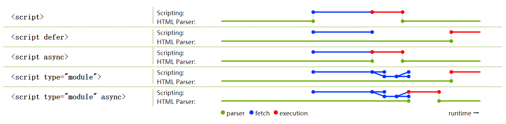

### 引入模块系统
- 浏览器在解析模块代码时默认开启严格模式
- 同一个模块如果加载多次，将只执行一次
- 模块中的顶层 `this` 关键字返回 `undefined` ，而不是指向 `window` 
- 代码是在模块作用域之中运行，而不是在全局作用域运行，模块内部的顶层变量，外部不可见，不会污染全局变量
-  `import` 命令加载其他模块 `.js` 后缀不可省略，需要提供绝对 `URL` 或相对 `URL` (相对的是当前文件的路径)
- 浏览器可以识别 `import` `export` 的前提是 `script` 标签必须有 `type="module"` 
- 浏览器会以 `defer` 方式下载并执行模块代码


### script脚本加载顺序


### 模块导出
一个模块就是一个独立的文件，设计思想是尽量的静态化，使得编译时就能确定模块的依赖关系，以及输入和输出的变量
```
// 声明变量并导出
export let word = '';
export function run() { }
export class Human { }

// 声明变量，单独导出
let word = '';
function run (){ }
class Human { }

export {word, run, Human};
// as 重命名导出变量
export {word as w, run as r,Human as H}
```
> 导出的变量，与其对应的值是动态绑定关系，可以取到模块内部实时的值   
> 导出命令可以出现在模块的任何位置，但是必须处于模块顶层就可以，不能出现在块级作用域和函数中


### 模块导入
```
// 不能更改导入的变量
import { word,run as r } from './human.js';

word = 'xxx'; // Syntax Error Assignment to constant variable
r = function() { } // Syntax Error Assignment to constant variable


// 有变量提升效果
run();

import { run } from './human.js'


// import语句会执行所加载的模块，且只会执行一次
import './human.js'; // 只有第一次导入时执行human.js文件
import './human.js';
import './human.js';


// 整体导入
import * as human from './human.js';

// 模块整体加载所在的那个对象，应该是可以静态分析的，所以不允许运行时改变
human.word = 'yyy'; // 错误
human.run = function() { }; // 错误
```


### 默认导出导入
```
export default class Human { }

export default function run () { }

class Human { }
export default Human;

function run () { }
export default run;

let word = 'xxx';
export default word;

export default 'yyy';

export default let word = 'xxx'; // 错误


import Human from './human.js';

import Human,{run, word} from './human.js';
```


### export 与 import 的复合写法
```
export { word, run as r } from './human.js';
// 相当于
import { word, run } from './human.js';
export { word, run as r };


// 复合写法只是转发接口，当前接口不能直接使用，必须额外导入
export { word, run } from './human.js';
console.log(word); // 错误


// 整体导出，类似模块继承
export * from './human.js'; // export * 会忽略模块的default


// 导出为默认
export { default } from './human.js';


// 具名导出为默认
export { Human as default } from './human.js';


// 默认接口具名导出
export { default as h } from './human.js';


// 现有其他提案
export * as h from './human.js';
export human from './human.js';
export huamn,{run, word} from './human.js';
```


### 动态导入
运行时动态加载模块，现在处于提案阶段
```
let path = './human.js';
import(path).then(({word,run,default})=>{
 ...
})

// 用在块级作用域
if(true){
  import(path);
}

// 用在函数中
function main(){
  import(path);
}
```


### 循环加载
... 