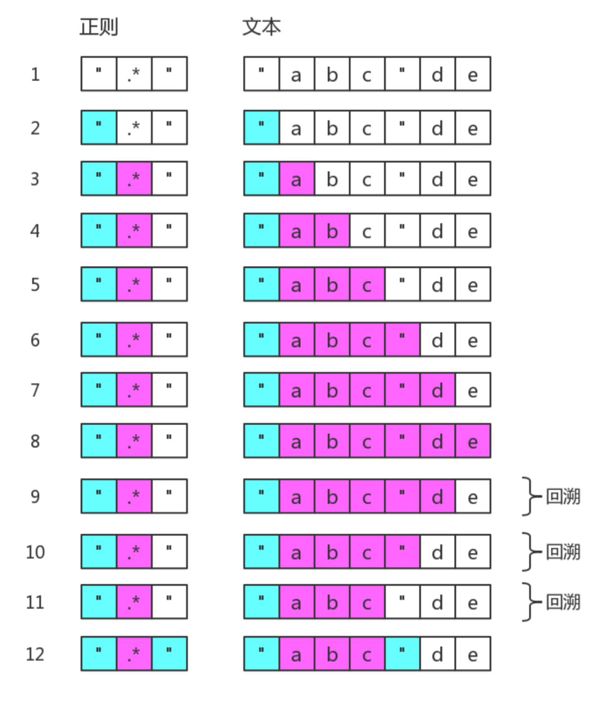
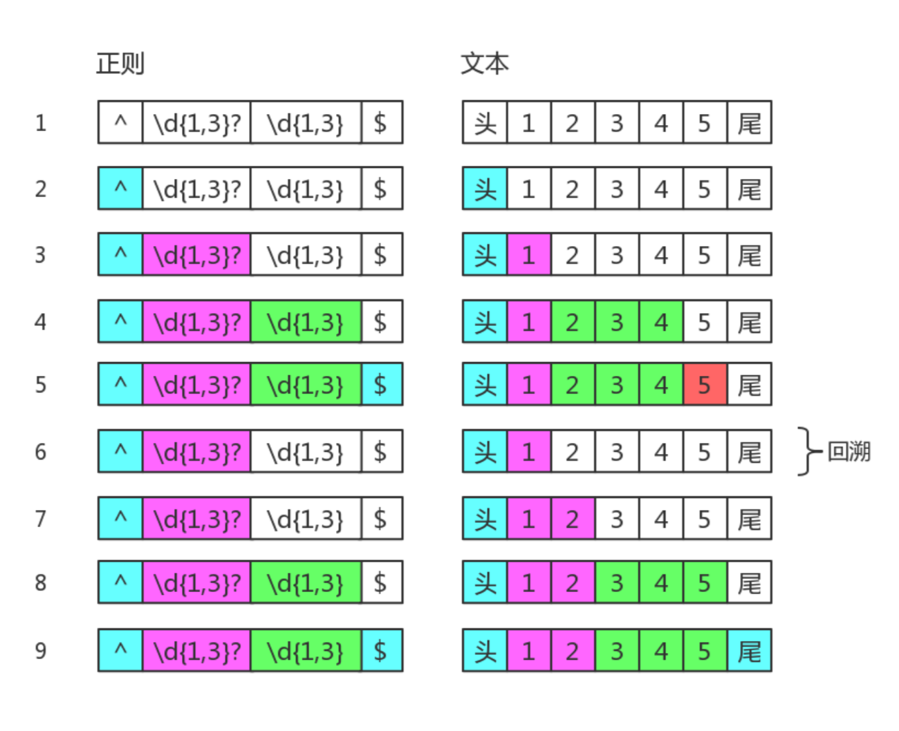
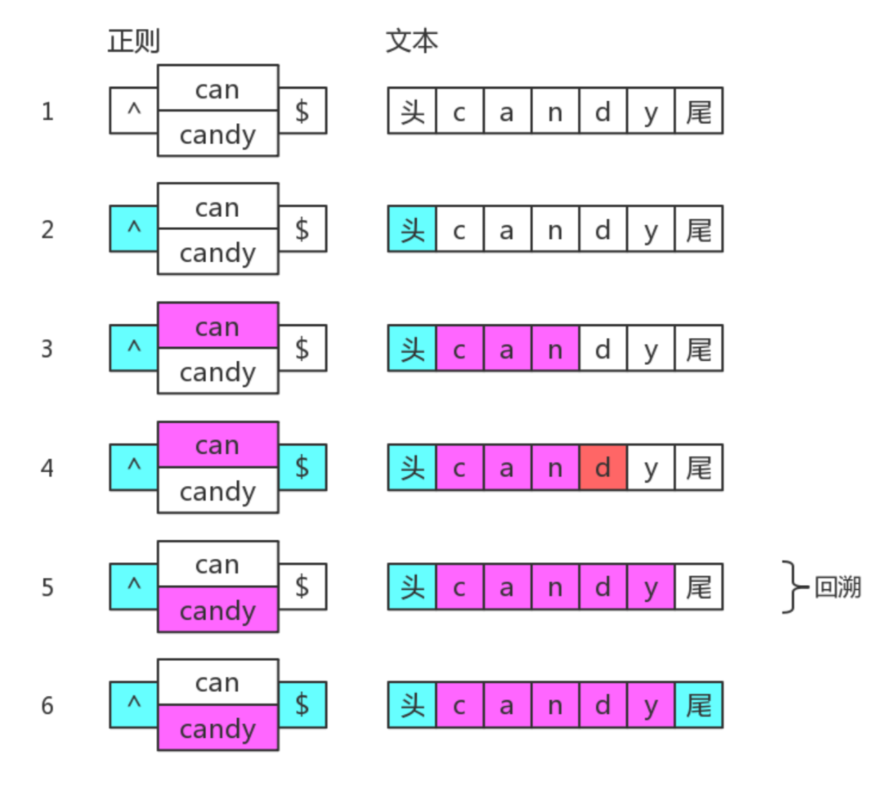

### 正则表达式
正则表达式作用是查找符合指定规律字符或者 **位置**


### 正则符号解释
**字符组**  
- **\d** 数字0到9（\D代表除此之外的字）
- **\w** 字母、数字、下划线（\W代表除此之外的字符）
- **\s** 空格、水平制表符、垂直制表符、换行符、回车符、换页符（\S代表除此之外的字符）
- **.**  除换行符、回车符、行分隔符和段分隔符之外的字符
- **[ ]** 可将任意字符组合为一个自定义字符组，在 `[]` 中 `^` 代表除自定义字符组之外的字符，`-` 代表连续字符，需要通过特殊方式单独代表该字符：`[-ab] [ab-] [a\-b]`  

**量词**  
- **{m , n}** 最少出现m次最多出现n次
- **{0 , n}** 最多出现n次(注意没有 { , n } 写法)
- **{m , }** 最少出现m次
- **?** 最多出现1次
- **+** 最少出现一次
- **&#42;** 可以出现任意次

**位置**  可以理解成空字符  
- **^** 默认指字符串开始位置，在多行模式下指每行的开始位置即字符串开头或者\n \r
- **$** 默认指字符串结束位置，在多行模式下指每行的结束位置即字符串结尾或者\n \r
- **\b** 单词边界，即\w与\W之间位置，还包括^与\w之间位置，\w与$之间位置，注意该处的^ $ 无论是否使用多行模式“m”，都可以代表每行的开头，因为\n\r都属于\W
- **\B** 除\b之外的位置
- **(?=exp)** 先行断言，指exp之前的位置
- **(?!exp)** 先行否定断言，除(?=exp)位置之外的位置 
- **(?<=exp)** 后行断言，指exp之外的位置
- **(?<!exp)** 后行否定断言，除(?<=exp)之外的位置

**修饰符**
- **g** 全局查找字符串中所有可能的匹配
- **i** 不区分大小写
- **m** 多行模式查找
- **u** 让正则可以正确处理大于\uFFFF的Unicode字符
- **y** 除包含g修饰符的功能外，每次匹配必须从紧接着上一次匹配的末尾开始，相当于每次匹配隐式添加 ^ 
- **s** 正则中的 . 表示任意字符包括换行符，回车符，行分隔符和段分隔符


### **m** 修饰符使用举例
```js
'hello\nworld\nyou'.replace(/^|$/gm,'#')
// 返回结果
#hello#
#world#
#you#    
```


### **\B** 使用举例
```
'movie[1].avi\nmm.mp4'.replace(/\b/g,'#')
// 返回结果
m#o#v#i#e[1]#.a#v#i
m#m.m#p#4
```


### 具名组匹配使用举例
```
const RE_DATE = /(?<year>\d{4})-(?<month>\d{2})-(?<day>\d{2})/; 
const matchObj = RE_DATE.exec('1999-12-31'); 
const year = matchObj.groups.year; // 1999 
const month = matchObj.groups.month; // 12 
const day = matchObj.groups.day; // 31

let re = /(?<year>\d{4})-(?<month>\d{2})-(?<day>\d{2})/u; 
'2015-01-02'.replace(re, '$<day>/$<month>/$<year>');

const RE_TWICE = /^(?<word>[a-z]+)!\k<word>$/; 
RE_TWICE.test('abc!abc') // true 
RE_TWICE.test('abc!ab') // false
```

### String.replace方法使用举例
```
'1234 2345 3456'.replace(/(\d)\d{2}(\d)/g, (match, $1, $2, index) => {
    console.log([match, $1, $2, index])
})
```


### 正则使用注意事项
- 量词默认为贪婪模式，可以在任意量词后面追加 ? 将其变为惰性模式
- 多选分支 /(a|b|c)/ 是惰性模式从左到右只要匹配一个就不在尝试，例如:’sorry’.match(/(so|sorr)/)  只会匹配so不会匹配sorr
- 注意位置元字符后面可以跟另一个位置元字符，例如 /\b$/.test('a') --> true ; 但是不能跟量词，例如 \B(?!exp) 
- 括号分组嵌套时，分组编号以左括号为准
- 使用非捕获分组时无法通过RegExp.$或者\1引用分组或者$1(replace方法)，但是返回结果还会有分组信息
- 正则回溯会影响性能，贪婪模式，惰性模式，分支结构都会造成回溯，例如 ‘12345’.match(/^(\d{1,3}?)(\d{1,3})$/)
- 在字符组中只有^ - [ ] 需要转义
- 多个贪婪量词紧挨着并互有冲突，前面的量词会比后面的量词获得更多的匹配字符，例如 '123456'.match(/(\d{1,3})(\d{1,3})(\d{1,3})/)
- `String.search` `String.match` 方法会把参数转为正则这个需要注意
- `String.split` 当正则使用分组时，结果数组中会包含分隔符，例如 ‘html,css,js’.split(/(,)/) ==> ["html", ",", "css", ",", "js”]
- 后行断言组匹配，从右边的组开始贪婪模式，分组引用顺序也相反  
/(?<=(\d+)(\d+))$/.exec('1053') // ["", "1", "053"]  
/^(\d+)(\d+)$/.exec('1053') // ["1053", "105", "3"]  
/(?<=(o)d\1)r/.exec('hodor')  // null  
/(?<=\1d(o))r/.exec('hodor')  // ["r", "o"]  


### 正则表达式的修饰符和各种方法的相互作用
- 字符串的match方法返回的结果格式与正则对象是否有g有关系，如果没有g返回的是正常匹配结果，有g返回的是所有匹配的内容  
```
var content = 'tom@gmail.com xxx jack@qq.com'
var reg = /([\w.]+)@[\w.]+\.(com|cn)/
var reg2= /([\w.]+)@[\w.]+\.(com|cn)/g
reg: [tom@gmail.com,tom,com]
reg2: [tom@gmail.com,jack@qq.com]
``` 
- 当正则表达式有g修饰符时，`String.match` 方法匹配的内容无法查看分组信息，可以通过 `RegExp.exec` 方法弥补。字符串match search split replace 每次执行都从0开始，而正则的exec test 方法如果修饰符有g则从上一次匹配位置之后开始


### 正则表达式使用举例
- 数字进行千位分割 `'123456789'.replace(/\B(?=(\d{3})+$)/g,',')` 
- 金额千分位分割 `1223 => Number(num).toFixed(2).replace(/\B(?=(\d{3})+\b)/g,',')`
- 匹配时间 23:59 或者 05:09 或者 5:9 `/(0?[0-9]|1[0-9]|2[0-3]|):(0?[0-9]|[1-5][0-9])/`
- 匹配日期时间 2017-12-31 12:23:33 `/[0-9]{4}-(0[1-9]|1[0-2])-(0[1-9]|[12][0-9]|3[01]) ([01][0-9]|2[0-3]):[0-5][0-9]:[0-5][0-9]/`
- 匹配html中的标签和id
```
/<([a-zA-Z]+)(\s+[^>]+\s+|\s+)id="([^"]+)"[^>]*>/g 贪婪模式
/<([a-zA-Z]+)(\s+|\s+[^>]+\s+)id="([^"]+)"[^>]*>/g 惰性模式
```
- 字符长度6-12位，由数字、小写字母、大写字母组成，但必须包含小写字母
 `/(?=.*[a-z])^[0-9a-zA-Z]{6,12}$/`
- 提取URL链接
- 提取网页图片
- 提取页面超链接
- 将日期格式 yyyy-mm-dd 替换成 mm/dd/yyyy
```
string.replace(/(\d{4})-(\d{2})-(\d{2})/g,'$2/$3/$1’) 
等价于
string.replace(/(\d{4})-(\d{2})-(\d{2})/g,() => {
    return `${RegExp.$2}/${RegExp.$3}/${RegExp.$1}`;
})
等价于
string.replace(/(\d{4})-(\d{2})-(\d{2})/g,(match, y, m, d) => {
    return m + ‘/‘ + d + ‘/‘ + y;
})
```
- 匹配如下日期格式
2016-06-12  
2016/06/12  
2016.06.12  
```
/\d{4}(-|\/|\.)\d{2}\1\d{2}/
```
- 模拟字符串trim 方法 `' xx '.replace(/^\s+|\s+$/,'')` 
- 将字符串中的单词首字母大写 `'wedf Sdf 324 sdqww SdfFS'.replace(/(^|\s)([a-z])/g,(c) => c.toUpperCase())`
- css属性驼峰化 background-color —> backgroundColor  -moz-transform —> mozTransform
- css属性反向去驼峰化 backgroundColor —> background-color
- 匹配成对标签 `<div>xx</div> —> true  <div>xxx</p> —> false`
```
// 惰性匹配 
'<div>xxx<p </div>'.match(/<([a-z]+)[^>]*>[^<]*<\/\1>/g);

// 贪婪匹配 
'<div>xxx<p </div>'.match(/<([a-z]+)[^>]*>[\d\D]*<\/\1>/g)
```


### API备忘录
- String#match
- String#matchAll
- RegExp#test
- RegExp#exec


### 回溯
**贪婪匹配造成的回溯** 
  
**惰性匹配导致回溯**  

**多选分支导致回溯**  



### 正则优化和技巧
- 尽量避免使用通配符 . 
- 尽量使用非捕获分组
- 尽量避免使用分支 /red|read/ /rea?d/
- 独立出确定字符 /a+/ 修改成 /aa*/
- 提取分支公共部分 /this|that/ 修改成 /th(?:is|at)/
- 使用正则表达式来代替 ||
```
reg = /^(aa|bb|cc)$/
reg.test(str1)  

// 相当于  
str1=== 'aa' || str2 === 'bb' || str3 === 'cc'  
```


### 扩展链接
- https://regex101.com/