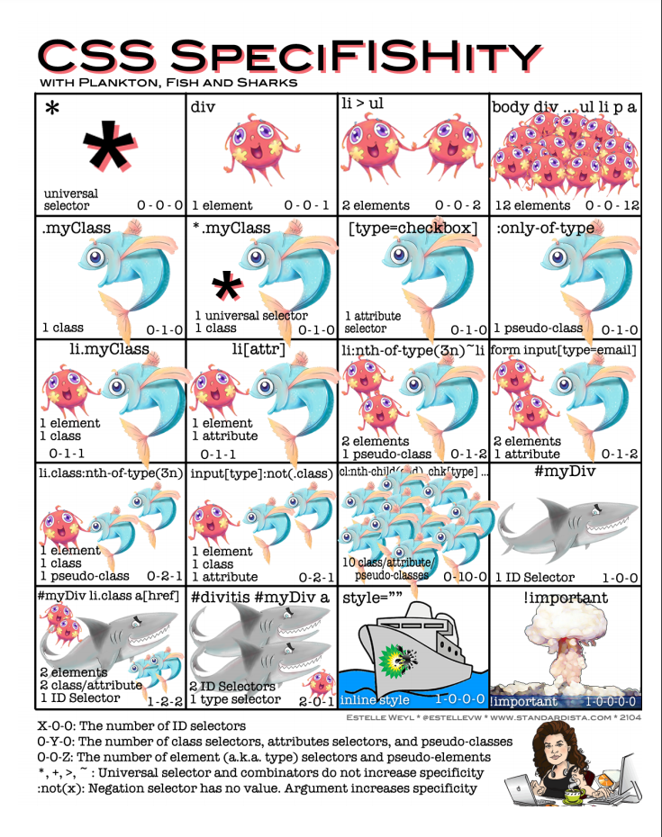

### 权重规则计算
- ID选择器 > 类选择器|伪类选择器|属性选择器 > 元素选择器|伪元素选择器 > 通配符选择器 > 浏览器默认继承的样式
- 同权重情况下：内联样式表（标签内部）> 嵌入样式表（当前文件中）> 外部样式表（外部文件中）
- 同权重同文件情况下，以文件中最后定义样式为准
- 同权重多个外部样式表，以最后的定位为准
- !important高于一切其他样式
- 权重计算不升位
- `:not` `>` `+` `~` 不参与权重计算

### 伪元素
`::after` `::before` `::selection` `::placeholder` `::first-letter` `::first-line`

### 伪类
`:nth-of-type()` `:nth-child()` `:checked` `:focus` `:disabled` `:enabled` `read-only` `read-write` `:target` `:not()` `:host()` `:host-context()` 

### white-space
| 属性值   | 源码空格 | 源码换行 | 内容超出容器边界换行 |
| -------- | -------- | -------- | -------------------- |
| normal   | 合并     | 忽略     | 换行                 |
| nowrap   | 合并     | 忽略     | 不换行               |
| pre      | 保留     | 换行     | 不换行               |
| pre-wrap | 保留     | 换行     | 换行                 |
| pre-line | 合并     | 换行     | 换行                 |

### 元素垂直方向的百分比设定是相对于父元素的高度吗?
- 如果是height的话，是相对于包含块的高度
- 如果是padding或者margin竖直方向的属性则是相对于包含块的宽度

### 元素隐藏
- `display: none` 不占据空间，不响应事件
- `width: 0;height: 0;overflow: hidden` 不占据空间，响应事件
- `opacity: 0` 占据空间，响应事件
- `visibility: hidden` 占据空间，不响应事件
- `position: absolute;left: -99999px` 不占据空间，响应事件
- `transform: scale(0,0)` 占据空间，不响应事件

### overflow: hidden可以剪切超出它范围的所有子代元素吗
如果 `overflow` 不是定位元素，则 `overflow` 无法对 `absolute` 子元素进行剪裁，同时如果 `overflow: auto | scroll`，即使绝对定位元素高宽比overflow元素高宽还要大，也不会出现滚动条

### font-weight 的特殊性
如果使用数值作为font-weight属性值，必须是100～900的整百数。因为这里的数值仅仅是外表长得像数值，实际上是一个具有特定含义的关键字，并且这里的数值关键字和字母关键字之间是有对应关系的

### display position float 的相互关系
- 首先当元素 `position: absolute | fixed` 浮动不起作用，display强制设置 `display: inline-block`
- 其次当元素 `float` 值不是 `none` ，强制设置 `display: inline-block`

### 外边距折叠
如果一个元素的 height 特性的值不是 auto，那么它的 margin-bottom 和它子元素的 margin-bottom 不算相邻，因此，不会发生折叠。 margin-top 没有此限制

### 浏览器渲染流程
- 构建DOM树
- 构建CSSOM树
- 整合DOM树和CSSOM树构建Render树（包含计算样式，不包含最终位置大小信息）
- 布局确定最终位置和大小信息，后续发生的布局称之为回流
- 绘制，后续发生的绘制称之为重绘
- 合成

即使请求页面的HTML大于数初始的14KB据包，浏览器也将开始解析并尝试根据其拥有的数据进行渲染。这就是为什么在前14Kb中包含浏览器开始渲染页面所需的所有内容，或者至少包含页面模板（第一次渲染所需的CSS和HTML）对于web性能优化来说是重要的。但是在渲染到屏幕上面之前，HTML、CSS、JavaScript必须被解析完成
  
等待获取CSS不会阻塞HTML的解析或者下载，但是它的确阻塞JavaScript，因为JavaScript经常用于查询元素的CSS属性

DOM 构造是增量的，CSSOM 却不是。CSS 是渲染阻塞的：浏览器会阻塞页面渲染直到它接收和执行了所有的 CSS。CSS 是渲染阻塞是因为规则可以被覆盖，所以内容不能被渲染直到 CSSOM 的完成

#### 构建DOM树
当解析器发现非阻塞资源，例如一张图片，浏览器会请求这些资源并且继续解析。当遇到一个CSS文件时，解析也可以继续进行，但是对于 `script` 标签（特别是没有 async 或者 defer 属性）会阻塞渲染并停止HTML的解析

#### 预加载扫描器
浏览器构建DOM树时，这个过程占用了主线程。当这种情况发生时，预加载扫描仪将解析可用的内容并请求高优先级资源，如CSS、JavaScript和web字体。多亏了预加载扫描器，我们不必等到解析器找到对外部资源的引用来请求它。它将在后台检索资源，以便在主HTML解析器到达请求的资源时，它们可能已经在运行，或者已经被下载。预加载扫描仪提供的优化减少了阻塞

#### 导致回流的操作
- 浏览器窗口大小发生改变
- 元素尺寸或位置发生改变
- 元素内容变化（文字数量或图片大小等等）
- 元素字体大小变化
- 添加或者删除可见的DOM元素
- 激活CSS伪类（例如：:hover）
- 查询某些属性或调用某些方法
  - clientWidth、clientHeight、clientTop、clientLeft
  - offsetWidth、offsetHeight、offsetTop、offsetLeft
  - scrollWidth、scrollHeight、scrollTop、scrollLeft
  - scrollIntoView()、scrollIntoViewIfNeeded()
  - getComputedStyle()
  - getBoundingClientRect()
  - scrollTo()

#### 浏览器回流优化
回流必将引起重绘，重绘不一定会引起回流，有时即使仅仅回流一个单一的元素，它的父元素以及任何跟随它的元素也会产生回流，
现代浏览器会对频繁的回流或重绘操作进行优化：

浏览器会维护一个队列，把所有引起回流和重绘的操作放入队列中，如果队列中的任务数量或者时间间隔达到一个阈值的，浏览器就会将队列清空，进行一次批处理，这样可以把多次回流和重绘变成一次。

当你访问以下属性或方法时，浏览器会立刻清空队列：
- clientWidth、clientHeight、clientTop、clientLeft
- offsetWidth、offsetHeight、offsetTop、offsetLeft
- scrollWidth、scrollHeight、scrollTop、scrollLeft
- width、height
- getComputedStyle()
- getBoundingClientRect()

#### 浏览器对样式和脚本的阻塞机制
- CSS 不会阻塞 DOM 的解析，但会阻塞 DOM 渲染，也就是在 CSS下载完成之前不会进行首次绘制
- JS 阻塞 DOM 解析，但浏览器会"偷看"DOM，预先下载相关资源
- 浏览器遇到 `script` 且没有defer或async属性的标签时，会触发页面渲染(渲染是在script下载之前)，因而如果前面CSS资源尚未加载完毕时，浏览器会等待它加载并渲染完毕在执行脚本
- `DOMContentLoaded` 事件触发时机是文档加载完毕，并且文档所引用的内联 js、以及外链 js 的同步代码都执行完毕后

