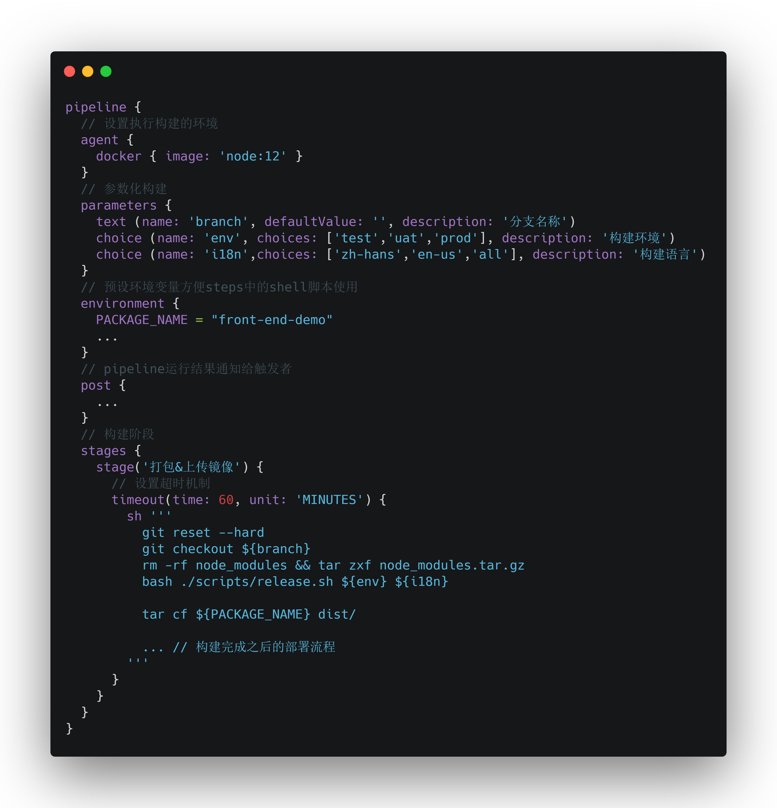

  
镜像实际上等价于未运行的容器（类似vmware快照），可以将镜像比作类（Class）把容器比作基于类创建的对象  
容器相当于一个 “完整” 运行的操作系统，镜像在打包生成的时候不会包含系统内核，所以容器调用的内核命令来自于它所处的宿主机  
在一个实体操作系统（宿主机）上可以同时运行多个虚拟操作系统（docker容器）。和vmware的区别是：多个docker容器使用同一个系统内核，而每个vmware虚拟系统都有各自的系统内核  

### docker命令
[安装docker](https://docs.docker.com/install/linux/docker-ce/centos/)
> 为了省去用sudo来执行docker，可以将当前用户放入docker用户组中： sudo 
usermod -aG docker $USER 退出生效  


下载镜像到本地： docker pull \<image>:\<tag>  
查看已经下载的镜像：docker images  
删除镜像：docker rmi \<image>  
基于镜像启动容器：docker run [ options ... ] \<image> [ command ]  [args ... ]   options参数说明如下  
- \-t    在新容器内指定一个伪终端或终端
- \-i    允许你对容器内的标准输入 (STDIN) 进行交互，经常和 -t 一起使用
- \-d   后台运行容器，容器内的控制台输出内容不在当前控制台显示
- \-p   指定容器暴露的端口，-p <主机ip:端口>:<内部端口> （可指定ip地址）
- \-v   指定容器暴露的路径，-v  <主机路径>:<内部路径>
- \-\-name 指定容器名称
- \-u   指定用户启动容器
- \-e   设置容器内的环境变量，-e <key>=<value>
- \-m  限制容器运行时可以使用的内存大小，-m 400M


启动容器并进入容器内部： docker run -it \<image> /bin/bash  
启动容器重命名并后台运行：docker run -d  -- name <容器名称> \<image>   
暴露容器内部端口和路径：docker  run  -d  -p  <主机ip:端口>:<内部端口>  -v <主机路径>:<外部路径> \<image>  
查看所有容器，包括停止的容器，同时显示容器占用的磁盘大小：docker ps -as  
进入正在运行容器内部：docker exec -it <容器名称>  
停止正在运行的容器：docker stop <容器名称>  
启动停止的容器：docker start <容器名称>  
查看容器中正在运行的进程：docker top <容器名称>  
查看容器控制台输出内容：docker logs <容器名称>  
查看容器对外暴露的端口：docker port <容器名称>  
查看docker系统信息，包括镜像和容器数：docker info  
将宿主机文件或目录拷贝到容器内部：docker cp <主机路径> <容器名称>:<容器路径>  
将容器内的文件或目录拷贝到宿主机外部：docker  cp <容器名称>:<容器路径>  <主机路径>  
查看镜像构建的历史记录：docker history  \<image>  
列出容器启动后修改过的文件：docker diff <容器名称>  
将本地镜像导出为文件：docker save -o <保存路径> \<image>  
将文件导入为镜像：docker load  --input <本地文件路径>   
将容器导出为文件：docker export <容器名称> <保存路径>  
将文件导入为容器：docker import <本地文件路径> <容器名称>  

### 使用docker安装jenkins
命令：
```
docker run -u root -d -p 8080:8080 -p 50000:50000 -v $HOME/jenkins:/var/jenkins_home -v /var/run/docker.sock:/var/run/docker.sock --name jenkins jenkinsci/blueocean 
```
[详情](https://jenkins.io/zh/doc/book/installing/)

### 使用docker安装gitlab
命令：  
```
docker run -d -h <ip|domain> -p 10443:443 -p 10080:80-p 10022:22--name gitlab --restart always 
-e GITLAB_OMNIBUS_CONFIG="external_url 'http://<ip|domain>/'"
-v $HOME/gitlab/config:/etc/gitlab -v $HOME/gitlab/logs:/var/log/gitlab -v $HOME/gitlab/data:/var/opt/gitlab 
gitlab/gitlab-ce 
```
[详情](https://docs.gitlab.com/omnibus/docker/#run-the-image)

### 基于Jenkinsfile和docker构建前端项目
Jenkinsfile内容如下：
