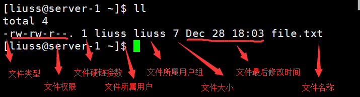
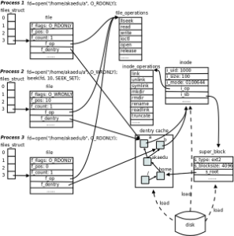

### ssh 远程登陆
- 一定不要使用root账号进行日常维护工作
- 常用格式  
`ssh  [-p port]  [user@]server_addr`  

### 系统目录
- 一切皆文件
- /boot 引导程序，系统内核等存放的目录
- /home/\<user> 普通用户的家目录
- /root/  root用户家目录
- /etc/  保存服务配置文件目录
- /var/  保存各类日志信息的目录
- /dev/ 系统通过这个目录里面的文件来和系统外部设备进行通信，比如硬盘，键盘，鼠标，网卡，终端
- /sbin  超级用户可以使用的命令的存放目录，类似目录还有 /usr/sbin   /usr/local/sbin
- /bin  普通用户可以使用的命令的存放目录，类似目录还有 /usr/bin   /usr/local/bin
- /lib  程序的共享库目录，类似目录还有 /usr/lib   /usr/local/lib
- /proc 这个目录采用一种特殊的文件系统格式（ proc 格式），其中包含了全部虚拟文件。它们并不保存在磁盘中，也不占据磁盘空间，当您查看它们时，您实际上看到的是内存里的信息，这些文件助于我们了解系统内部信息
- /tmp  该目录存放系统中的一些临时文件，文件可能会被系统自动清空，该目录属于内存类型的文件系统
- /usr/local 通过源码方式安装的软件一般保存在这里
- /usr/bin 常用命令所在目录

### 命令行快捷键
- tab键作用：自动补全命令，在当前目录检索文件名并和当前输入内容进行匹配
- 将光标移动到行首 ctrl + a
- 将光标移动到行尾 ctrl + e
- 将光标向前移动一个单词 alt + f
- 将光标向后移动一个单词 alt + b
- 删除光标位置到行首的内容 ctrl + u   同时将内容复制到剪贴板中，其实就是剪贴功能
- 删除光标位置到行尾的内容 ctrl + k   同时将内容复制到剪贴板中，其实就是剪贴功能
- 在命令行历史记录中搜索特定命令 ctrl + r 然后输入需要搜索的命令
- 阻止系统向屏幕输出内容 ctrl + s
- 允许系统向屏幕输出内容 ctrl + q
- 终止当前正在执行的命令 ctrl + c
- 挂起命令  ctrl + z   将挂起的命令放到后台执行  bg  将挂起的命令放到前台执行 fg 查看-当前shell 发起并运行的程序  jobs
- 退出终端后终端下的命令继续执行  nohup  \<command> 2>&1 &

### 给普通用户提升超级管理员权限
- 首先通过以超级管理员身份登陆
- 然后修改 /etc/sudoers 文件 
- 添加内容:  \<username>  ALL=(ALL) ALL

### 通过yum安装软件
- 查看软件信息  sudo yum  info  \<command> 
- 安装软件  sudo yum install \<command>
- 卸载软件  sudo yum remove \<command>
- 安装epel源 sudo yum install epel-release
> 如果你在 CentOS 上通过 yum 安装软件，遇到一些莫名其妙的错误，那么可以试着运行「yum clean all」看看，此命令的作用就和编译源代码时常用的「make clean」差不多，都是删除缓存文件，在你一筹莫展的时候往往能给你意外的惊喜

### 安装node环境
- 执行命令 curl -sL https://rpm.nodesource.com/setup_11.x | sudo bash -
- 执行安装 sudo yum install nodejs -y

### 查看系统信息
- 查看系统版本 uname -a 或者 cat /etc/issue  或者 cat /etc/redhat-release
- 查看系统物理cpu数量  cat /proc/cpuinfo | grep 'physical id' | uniq | wc -l
- 查看每个物理cpu的核数  cat /proc/cpuinfo | grep 'cpu cores' | uniq
- 查看cpu型号  cat  /proc/cpuinfo | grep name
- 查看内存信息 free -m
- 查看系统磁盘分区  fdisk -l
- 查看系统分区使用情况  df -h
- 查看系统dns配置信息  cat  /etc/resolv.conf
- 查看系统网络配置信息  cat  /etc/sysconfig/network-scripts/ifcfg-<网卡接口>
- 查看系统登录欢迎语  cat  /etc/motd
- 查看系统级别日志信息  tail  -f  /var/log/messages
- 查看用户登录日志信息  tail  -f  /var/log/secure
- 查看系统磁盘挂载信息  cat  /etc/fstab
- 查看环境变量  env
- 查看系统所有用户列表 cat  /etc/passwd
- 查看当前登录的用户 who
- 查看用户登录历史纪录  last
- 查看系统当前时间 date '+%Y-%m-%d %H:%M:%S'  只查看日期  date  '+%F'  只查看时间  date  '+%T' 

### 服务管理
- 启动 / 停止 / 重启 / 服务 / 检查 服务   systemctl  start | stop | reload | status  <service-name>
- 设置服务开机自起  systemctl enable \<service-name>
- 查看系统注册的所有服务 systemctl  list-unit-files  --type=service

### 查看文件内容
- 查看文件全部内容  cat \<filename>
- 查看文件前几行内容 head   -n  10  \<file>
- 查看文件最后几行内容 tail   -n  10  \<file>
- 实时查看文件最后几行内容   tail  -f  -n  10  \<file>
- 不停的尝试打开文件直到打开为止  tail  --retry  -f \<file>

### 查看文件属性信息
- 查看单个文件详细信息  stat  \<file>
- 批量查看文件详细信息  ls  -l  
- 批量查看文件修改 / 更新 时间  ls -l   --time={atime|ctime}
- 查看目录本身信息  ls  -d  <目录>
- 查看文本文件编码信息 file  \<file>
- 查看最近更新过的文件  ls  -lt

### 文件操作
- 创建空文件  touch  \<file>
- 复制文件时保留文件的所有信息 cp -a \<srcfile> \<distfile>
- 在文件末尾追加内容  echo  'abcd...'  >>  test.txt
- 覆盖文件中原有的内容  echo  'abcd...'   >>  test.txt
- 创建硬链接 ln  <源文件>  <目标文件> 
- 创建软链接 ln  -s  <源文件>  <目标文件>
- 修改文件权限  chmod  a+rw  <文件>
- 修改目录下所有文件的权限  chmod  -R  a+rw  <文件>
- 修改文件所属用户  chown  <用户名>  <文件>
- 修改目录下所有文件的所属用户 chown -R  <用户名>  <文件>

### 查看进程
- 实时查看当前系统进程信息 top
- 查看当前时刻进程信息  ps  -au
- 查看单个服务创建的所有进程包括子进程  pidof  \<service_name>

### 进程管理
- 强制杀死进程  kill  -9  \<pid>

### 实用命令
- 下载文件 wget  \<url> 
- 统计内容行数 wc -l 
- 查看当前所在目录  pwd
- 快速返回上一次导航的目录 cd -
- 在文件搜索关键内容  grep  abcd  \<file>
- 过滤命令输出内容  ls  -l  |  grep  abcd
- 查看命令的绝对路径 which  \<command>
- 创建别名  alias  ll="ls -ali"
- 配置环境变量并立即生效  在/etc/profile文件最后添加环境变量设置，保存，source /etc/profile，如果只想作用当前用户，则修改当前用户主目录下的 ~/.bash_profile

### vi操作文件
- 模式：只读模式（默认模式）、命令模式、编辑模式、选择模式
- 模式切换：只读模式 → 命令模式   输入 " : " ；只读模式 → 编辑模式  输入  " i " 或者 " o " ；只读模式  → 选择模式  ctrl  + v ; 从其他模式返回只读模式  esc 
- 光标移动（只读模式）
  - 将光标移到行首 ： 0
  - 将光标移到行尾 ： $
  - 将光标移到文件第 n 行  ： ngg  （n不写移到文件第一行）
  - 将光标移到文件最后一行 ：G
  - 向上移动一个段落：{
  - 向下移动一个段落：}
  - 将光标移到距离屏幕顶部最近的一行：H
  - 将光标移到距离屏幕底部最近的一行：L
- 文件内容滚动
  - 向上滚动半屏：ctrl + u
  - 向下滚动半屏：ctrl + d
  - 向上滚动一屏：ctrl + b
  - 向下滚动一屏：ctrl + f
- 复制/剪贴/粘贴/撤销/重做
  - 从光标所在位置向下复制 n 行 ：nyy （n不写只复制当前行）
  - 从光标所在位置向下剪贴 n 行 ，也可用于删除 n 行：ndd（n不写只剪贴当前行）
  - 将光标所在位置到行首的内容复制到剪贴板中：d0
  - 将光标所在位置到行尾的内容复制到剪贴板中：d$
  - 将剪贴板中的内容粘贴到光标所在行的下一行：P
  - 撤销上一步的操作：u
  - 在进行过撤销操作之后重做：ctrl + r
- 内容查找/替换
  - 进入命令模式，向下查找内容： /<要查找的内容>
  - 进入命令模式，替换全部内容： g/<要查找的内容>/s//<要替换的内容>/g 
  - 移动光标到下一个查询结果：n
  - 移动光标到上一个查询结果：N
- 批量注释内容
  - 将光标移到要注释内容的第一行行首，进入选择模式，选择需要注释的行，输入 " I " ，输入注释的符号 # 或者 // ，按 esc 键
- 取消注释
  - 将光标移到注释内容的第一行行首，进入选择模式，选择需要取消注释的行，输入 “ d ”
- 保存/退出/保存并退出/强制退出
  - 进入命令模式，输入 w 保存内容，输入 q 退出，输入 x 保存内容并退出，输入  q! 保存并退出

### 文件属性

- 文件类型
  - \- 普通文件
  - d 目录
  - l 软连接文件
  - b 块文件，比如硬盘
  - s 套接字文件，比如数据库 *.lock
- 文件权限
  - r ：4读权限 ，w ：2 写权限 ，x ： 1 执行权限； - 无权限 
  - 前三个字符代表文件所属用户对文件拥有的权限
  - 中间三个字符代表文件所属用户组对文件拥有的权限（排除所属用户）
  - 最后三个字符代表其他用户对文件拥有的权限
- 文件硬链接数，如果是目录则代表目录第一级子目录数
- modifyTime 文件修改时间指内容修改的时间，changeTime 文件变化时间指文件内容变化，文件移动，文件属性变化的时间

### 查找文件
- 根据文件名查找：find . -name "*txt"  查找以txt结尾的文件，注意查找内容用双引号包裹
- 根据文件大小查找： find .  -size  +100M   查找大于100兆的文件
- 根据修改时间查找： find  .  -mtime -2  查找最近两天修改过的文件 ；find .  -mtime + 2 查找两天之前的修改过的文件
- 忽略某个文件夹：find . -name "*txt" 
- 删除查找到的文件：find  .  -size  +100M -exec rm  -rf  {}  \;  （注意命令结尾的 \; ）   相当于   find  .  -size +100M  | xargs -i  rm -rf {} 

### 文件压缩/解压
- 压缩文件：tar  -zcvf  data.tar.gz  ./data   注意压缩目录时需要使用相对路径
- 解压文件：tar  -zxvf  data.tar.gz  
- 选择性压缩： tar  -zcvf  data.tar.gz  \`find .  -name "*txt"\` 
- 压缩时排除某个目录  tar  -zcvf  data.tar.gz  --exclude <目录>

### 虚拟文件系统
- 虚拟文件系统是磁盘文件系统的内存映射，由它来组织用户看到树形结构，启动系统后，先有这个虚拟文件系统，同时创建根目录，然后把硬盘挂载到树形结构的对应的节点上
- 虚拟文件系统主要的对象：
  - 超级块对象super_block，保存文件系统元数据，操作系统可以包含多个文件系统
  - 索引节点对象inode，保存文件的元数据
  - 目录项对象dentry，代表文件树中的一个节点
  - 文件对象，代表由进程打开的具体文件，保存从具体文件系统中读取的数据以及将要写入文件系统的数据
- 虚拟文件系统将文件抽象成两个部分：
  - 文件元数据，包含文件inode号，文件类型，文件读写权限，文件所属用户，所属组，文件大小，文件创建时间，更新时间，修改时间，数据块指针等
  - 文件数据块，包含文件本身的数据，一个文件可能会包含多个数据块
- 进程打开文件的一般步骤
  - 首先根据文件路径在文件树中找到对应的inode号
  - 然后根据inode号找到对应的inode，即文件元数据
  - 在通过文件元数据中包含的指针找到文件所有的数据块
- 删除文件的条件：文件元数据（inode）中的硬链接数必须等于0，文件的使用计数器必须等于0
- 查看文件系统使用量信息：df -h
- 查看整个目录的大小：du -sh
- 查看文件系统磁盘读写信息：iostat
- 查看系统所有的磁盘信息，包括未挂载的磁盘，以树形结果展示：lsblk
- 查看进程打开文件列表：lsof -c <进程名称> 或者 lsof -p <进程号>
- 查看文件被哪个进程打开：lsof <文件路径>
- 查看目录下的文件被那些进程打开：lsof +D <目录路径>  

### 硬链接和软链接
- 硬链接文件不是真正的文件，只是目录文件中保持了一条文件记录，inode号指向文件系统中已存在的文件的inode号
- 软链接是一个单独的文件，但是文件的数据块中含有另外一个文件的路径信息
- 软链接指向的文件可以跨文件系统，硬链接不行
- 软连接可以对一个不存在的文件进行链接，硬链接必须保证文件已经存在

### centos7 最小化版本系统初始化
- yum  update   更新软件和系统内核
- yum  clean  all  清理缓存
- yum  makecache  建立最新缓存
- yum  install epel-release  安装第三方yum源
- yum  install  wget  vim  lsof  unzip  git   安装必要工具
- systemctl stop firewalld   关闭防火墙服务
- systemctl disable firewalld  永久关闭防火墙
- setenforce 0  关闭Selinux
- vim /etc/selinux/config  永久关闭Selinux
- curl --silent --location https://rpm.nodesource.com/setup_12.x | sudo  bash - &&  sudo  yum install -y nodejs  安装node
- sudo yum install yum-utils device-mapper-persistent-data lvm2  安装docker依赖
- sudo yum-config-manager --add-repo https://download.docker.com/linux/centos/docker-ce.repo  安装docker的yum源
- sudo yum install docker-ce docker-ce-cli containerd.io  安装docker
- sudo systemctl enable docker && sudo systemctl start docker  启动docker