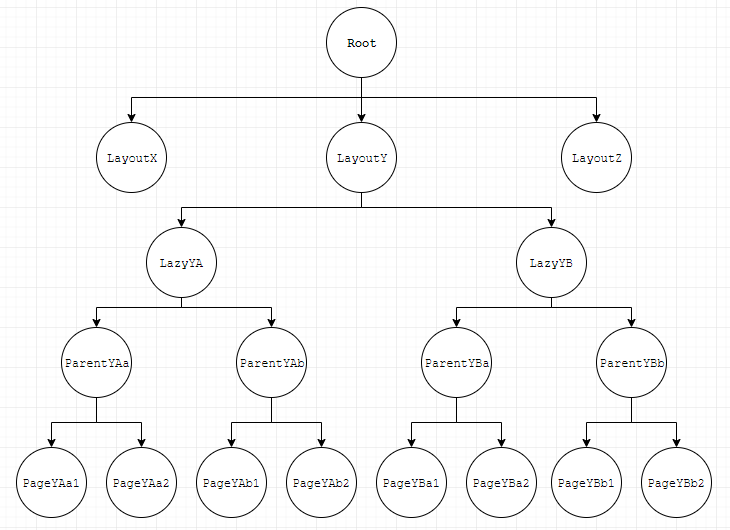
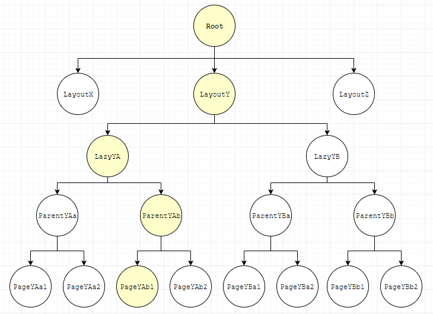
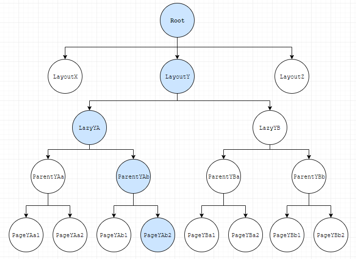
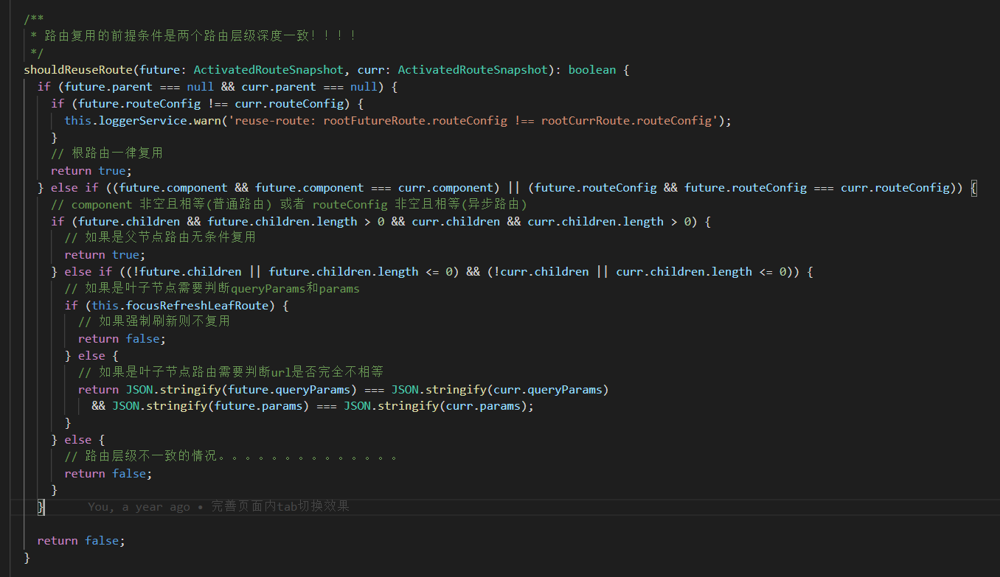
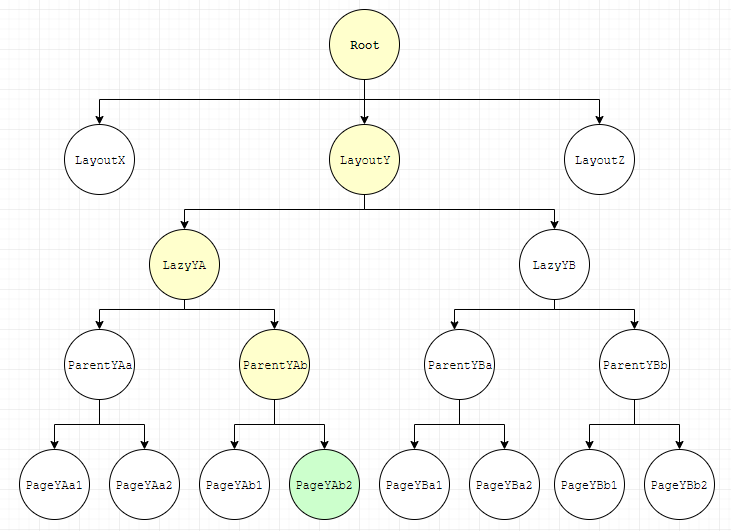

处理路由跳转时新旧路由树如何转变的策略，分两阶段处理：复用阶段，更新阶段；现有两种策略：默认策略，自定义策略
> 路由复用的前提为两个路由树层级一致
“复用”指两个路由跳转时，旧路由树中哪些节点Component需要保留在DOM树中

### 默认策略
比较新旧路由树中每个节点，只有节点相同的才会复用（内部比较routeConfig是否相同），否则旧路由树的节点自动销毁，新路由树的节点自动创建

### 自定义策略
Angular在合适时机主动调用，shouldReuseRoute、retrieve、shouldDetach、store、shouldAttach，以此实现自定义策略

### 多标签页
类似tab组件切换功能，但是tab切换的内容为独立页面，也就是切换tab时页面地址会对应改变，同时能够缓存页面的状态信息，该场景需要使用自定义路由复用策略，以下为后台管理型页面常见路由结构

> 路由树中的每个节点，通过路由配置信息生成，和path没有完全对应关系（/demo/page），请区别对待

**Root**：根路由，Component为系统根组件，由路由模块自动生成    
**Layout**：布局路由，Component为布局组件，根据RouterModule.forRoot(routes)配置生成，routes中的每一个元素为一个布局路由   
**Lazy**：懒加载路由，Component为null，根据RouterModule.forRoot(routes)配置生成，routes中每个元素的children数组每一项为懒加载路由   
**Parent**：父级页面路由，Component为父级页面组件，根据上一级路由Lazy关联子模块中的RouterModule.forChild(routes)配置生成，routes中的每一个元素为一个父级页面路由   
**Page**：页面路由，Component为页面组件，根据RouterModule.forChild(routes)配置生成，routes中的每个元素的children数组每一项为页面路由   
> 通常一个Lazy下只有一个Parent，一个Parent下有多个Page，且后台管理系统Layout通常也只存在一个Lazy，也就是Root→ Layout→ Lazy→ Parent→ PageX
> Layout、Parent、Page是根据UI展示抽象出来的概念，Angular路由中不存在这些概念，统称路由

### 当PageYAb1 → PageYAb2
   
**→**   
  
> PageYAb1为左侧黄色节点组成的结构简称old路由，PageYAb2由右侧蓝色节点组成的结构简称new路由

### 自定义复用策略：
    

**自定义缓存策略**：只缓存**Page**路由（用户关闭Page的情况除外）

### 复用阶段
从Root依次往下比较两个路由树的对应节点（白色节点不参与，只有黄色和蓝色节点参与），例如：Root(old) ↔ Root(new) 、LayoutY(old) ↔ LayoutY(new)、LazyYA(old) ↔ LazyYA(new)、ParentYAb(old) ↔ ParentYAb(new)、PageYAb1↔ PageYAb2

1. 每个节点都会调用**shouldReuseRoute**返回比较结果，返回true时，表示old节点需要复用（对应Component会留在Dom树中）；  
2. 返回 false 时**retrieve**会被调用，当返回有值时，new节点会利用该值，当返回null时new节点会被重新创建（该步骤有点多余）  

最终生成合成树   

### 合成树
   
由于Root、LayoutY、LazyYA、ParentYAb相等所以被复用，只有PageYAb1被替换为PageYAb2   

### 更新阶段
更新阶段会将合成树和旧路由树做比较，处理节点更新；   
从Root依次往下比较两个路由树的对应节点（白色节点不参与，只有黄色和蓝色节点参与），例如：Root(old) ↔ Root(new) 、LayoutY(old) ↔ LayoutY(new)、LazyYA(old) ↔ LazyYA(new)、ParentYAb(old) ↔ ParentYAb(new)、PageYAb1↔ PageYAb2   

1. 如果节点相同不做任何操作
2. 如果节点不同，首先调用 **shouldDetach** 确定 **old** 节点是否需要缓存，如果返回true，接着调用 **store** 进行缓存，否则 **old** 节点自动移除
3. 然后调用 **shluldAttach** 确定 **new** 节点是否需要从缓存中恢复，如果返回true，接着调用 **retrieve**，否则 **new** 节点自动创建
4. 最后调用一次 **store** 方法handle为 **null**，目的在于将new节点从缓存中移除保证缓存中没有多余数据

   
**→**  
  

这个过程 PageYAb1被缓存下来 ，同时新建PageYAb2节点    

### PageYAb2 → PageYAb1
这个过程PageYAb1从缓存中移除 （更新阶段4）同时PageYAb2被缓存下来，注意PageYab1不会创建而是从缓存中复用  
> retrieve（PageYAb1）被调用两次，复用阶段2和更新阶段3

### PageYAb1 → PageYBa1
这个过程PageYAb1被缓存下来，同时新建PageYBa1   

### PageYBa1 → PageYAb1
这个过程PageYBa1被缓存下来，PageYAb1从缓存中移除（更新阶段4），注意PageYAb1不会创建而是从缓存中复用   
> retrieve（PageYAb1）被调用两次，复用阶段2和更新阶段3

### 关闭PageYAb1，自动切换到PageYAb2
这个过程PageYAb1和PageYAb2会同时从缓存中移除  